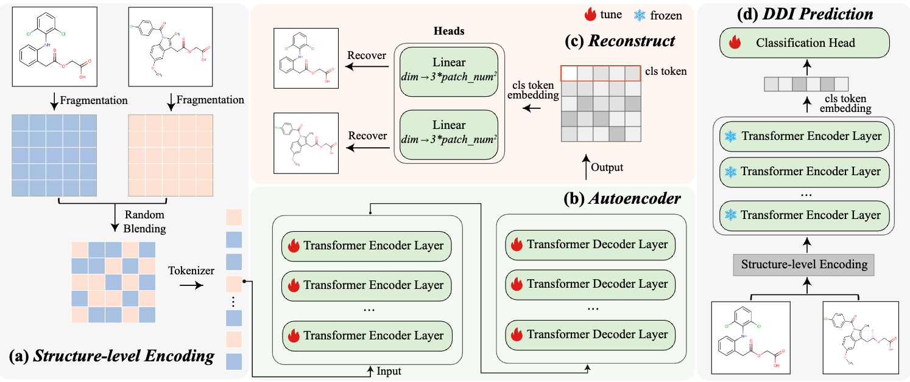

# Blending Structural Context of Visual Molecules for Drug-Drug Interaction Prediction

This is the code necessary to run experiments on the S²VM algorithm described in the paper [Unified Visual Molde for DDI prediction]().

## Abstract
Identifying drug-drug interactions (DDIs) is essential for ensuring drug safety and facilitating drug development, which has garnered significant attention. Although existing methods have achieved impressive progress, the paradigm of learning from separate drug inputs still faces challenges: (1) \textit{limited structural representation fusion of DDI pairs}, and (2) \textit{the absence of spatial information regarding the internal substructures of the molecules}. We incorporate the explicit structure of visual molecules, such as the positional relationships and connectivity between functional substructures, and propose a pair-wise molecular self-supervised pretraining model for DDI prediction, named S²VM. Specifically, we blend the visual fragments of drug pairs into a unified input for joint encoding and then recover molecule-specific visual information for each drug individually. This approach integrates fine-grained structural representations from drug pairs. By using visual fragments as anchors, S²VM effectively captures the spatial information of substructures within visual molecules, representing a more comprehensive embedding of drug pairs. Experimental results show that S²VM, adopting a blending input to unified represent pair-wised visual molecules, achieves state-of-the-art performance on two benchmarks, with Macro-F1 score improvements of 3.13% and 2.94%, respectively. Further extensive results demonstrate the effectiveness of S²VM in both few-shot and inductive scenarios.


## Requiremetns

All the required packages can be installed by running `pip install -r requirements.txt`.
```
tensorboard==2.9.1
scikit-learn==0.22.1
torch==1.11.0+cu113
tqdm==4.61.2
rdkit==2023.9.6
```

## Preprocess
In the pretraining stage, we adopt a molecule collections from [ImageMol](https://drive.google.com/file/d/1t1Ws-wPYPeeuc8f_SGgnfUCVCzlM_jUJ/view?usp=sharing), you can download this data into `datasets/pretrain`

All molecular images used on the pretraining and DDI prediction stages need to be preprocessed. The following command is necessary:

- `python preprocess.py --type DDI`

You can process molecular images for different stages by change the param `--type`. `--type pretrain` for pretraining, `--type DDI` for DDI prediction, and `--type twosides_ind` for the inductive scenario.

## Pretraining a unified model for representing drug pairs
After preprocessing the molecular images, you can use the following command to pretrain a unified transformer-based encoder for modeling a pair of drugs.

`python mae_pretrain.py --scale 200000`

The param `--scale` represents the scale of molecules.

## DDI prediction
After pretraining a unified encoder, you can run the following command to get a DDI prediction model:

`python mae_classifier.py --pretrained_model_path ckpts/mae/vit-t-mae_8layers_patch16.pt`

For few-shot settings:

`python mae_classifier.py --pretrained_model_path ckpts/mae/vit-t-mae_8layers_patch16.pt --fewshot fewer`

You can change `--fewshot rare` for difficult few-shot setting.

For the inductive setting:

`python mae_classifier_ts.py --pretrained_model_path ckpts/mae/vit-t-mae_8layers_patch16.pt --fold S1`

You can change `--fold S2` for S2 setting (two new drugs), S1 setting (one new drug, one existing drug).

## Additional Experiments
To further evaluate the generalization and robustness of S²VM, we conduct additional experiments on several model variants, including the I-JEPA variant and the Single-Molecule (MAE) variant.

You can move the corresponding files to the main directory and run the code in the same way as before.

In addition, we include the implementation of a single-head reconstruction model variant (code only, without a pretrained checkpoint).

## Acknowledge
The code is implemented based on MAE_pytorch (https://github.com/IcarusWizard/MAE/tree/main). The benchmark datasets are from [MRCGNN](https://github.com/Zhankun-Xiong/MRCGNN) (Deng&Ryu datasets), [EmerGNN](https://github.com/LARS-research/EmerGNN) (inductive), and process few-shot data based on [META-DDIE](https://github.com/YifanDengWHU/META-DDIE).
We thank you very much for their sharing.
